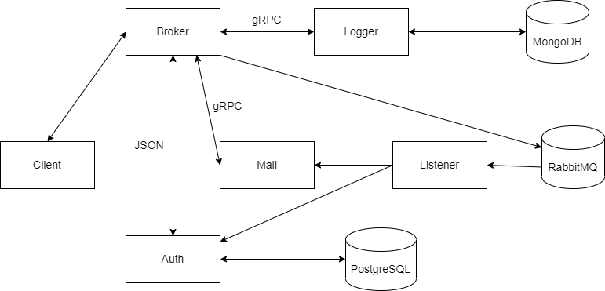

# DEMO MICROSERVICE

**I.Architecture**

**II.Technology**

- [x] Golang
- [x] go-chi
- [x] RabbitMQ
- [x] gRPC
- [x] PostgresSQL
- [x] MongoDB
- [x] Mailhog
- [x] Docker
- [ ] Docker Swarm

**III.Documnent**

- Send mail:
  POST http:\/\/localhost:8000/handle

```
{
    action: "mail",
    mail: {
        from: "me@example.com",
        to: "you@there.com",
        subject: "Test email",
        message: "Hello world!",
    }
}
```

- Log event:
  POST http:\/\/localhost:8000/handle

```
{
    action: "log",
    log: {
        name: "event",
        data: "Some kind of data",
    }
}
```

- Authentication
  POST http:\/\/localhost:8000/handle

```
{
    action: "auth",
    auth: {
        email: "admin@example.com",
        password: "verysecret!",
    }
}
```
